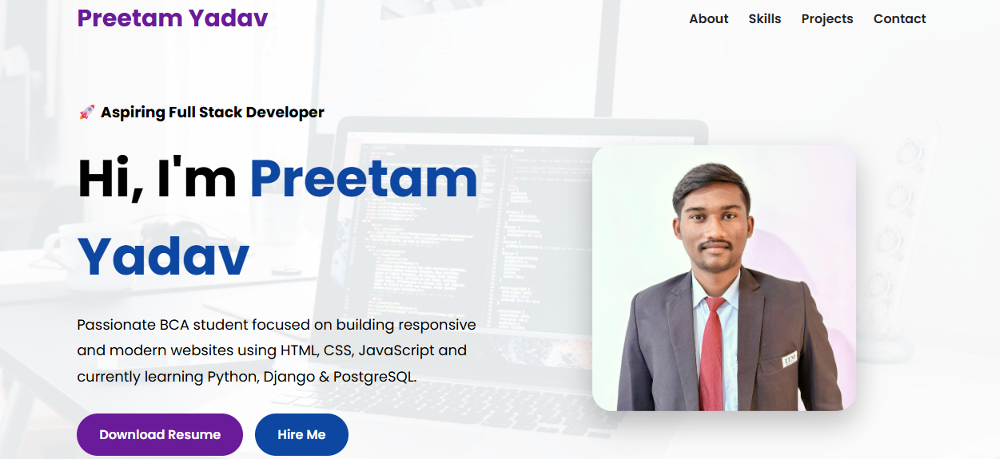

<h1 align="center">🚀 Preetam Yadav Portfolio</h1>

<h3 align="center">
Aspiring Full Stack Developer | BCA Student
</h3>

Modern Responsive Portfolio Website built using HTML, CSS & JavaScript

---

# 🌟 Features

✨ Modern UI Design  
✨ Fully Responsive Website  
✨ Smooth Animations & Transitions  
✨ Mobile Friendly Layout  
✨ Download Resume Button  
✨ Attractive Project Section  
✨ Contact & Social Links  
✨ SEO Optimized Structure  

---

# 🚀 Live Demo

https://preetamyadavportfolio.netlify.app/

---

# 💻 Tech Stack

---

# 📂 Projects

## 🔹 Codixa Sankalp
E-Learning Website developed for a real client using HTML, CSS & JavaScript.

## 🔹 Portfolio Website
Personal responsive portfolio website with modern UI and animations.

---

# 📸 Portfolio Preview

---

# 📫 Connect With Me

🔗 LinkedIn: linkedin.com/in/preetamyadav7576

🔗 GitHub: github.com/preetamyadav7576

📧 Email: preetamyadav7576@gmail.com

📱 Phone: 9580821616

---

✨ Designed & Developed by <b>Preetam Yadav</b> 🚀

